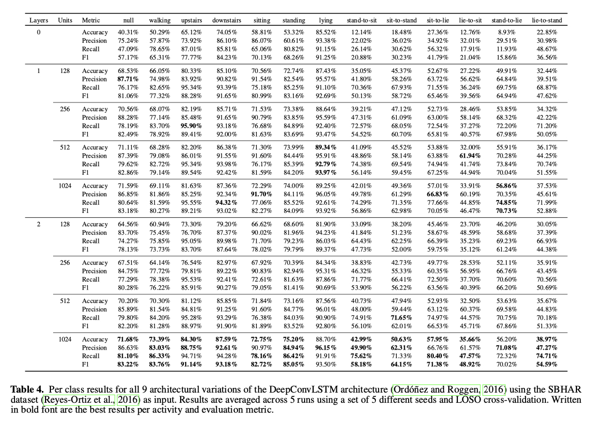

# Investigating (Re)current State-of-the-art in Human Activity Recognition Datasets

This is the official GitHub page of the journal article "Investigating (Re)current State-of-the-art in Human Activity Recognition Datasets" accepted for the Mobile and Ubiquitous Computing section in Frontiers in Computer Science. [[cite our work]](#cite)

## Abstract

Many human activities consist of physical gestures that tend to be performed in certain sequences. Wearable inertial sensor data have as a consequence been employed to automatically detect human activities, lately predominantly with deep learning methods. This article focuses on the necessity of recurrent layers - more specifically Long Short-Term Memory (LSTM) layers - in common Deep Learning architectures for Human Activity Recognition (HAR). Our experimental pipeline investigates the effects of employing none, one, or two LSTM layers, as well as different layers' sizes, within the popular DeepConvLSTM architecture. We evaluate the architecture's performance on five well-known activity recognition datasets and provide an in-depth analysis of the per-class results, showing trends which type of activities or datasets profit the most from the removal of LSTM layers. For 4 out of 5 datasets, an altered architecture with one LSTM layer produces the best prediction results. In our previous work we already investigated the impact of a 2-layered LSTM when dealing with sequential activity data. Extending upon this, we now propose a metric, r_GP, which aims to measure the effectiveness of learned temporal patterns for a dataset and can be used as a decision metric whether to include recurrent layers into a network at all. Even for datasets including activities without explicit temporal processes, the r_GP can be high, suggesting that temporal patterns were learned, and consequently convolutional networks are being outperformed by networks including recurrent layers. We conclude this article by putting forward the question to what degree popular HAR datasets contain unwanted temporal dependencies, which if not taken care of, can benefit networks in achieving high benchmark scores and give a false sense of overall generability to a real-world setting.

## Results
Results were obtained on the Wetlab [[5]](#5), RWHAR [[7]](#7), SBHAR [[3]](#3) and HHAR [[6]](#6) and Opportunity dataset [[4]](#4) using LOSO cross-validation averaged across 5 runs using a set of 5 different random seeds. In total we evaluated three architectures: the original DeepConvLSTM [[1]](#1), an altered version of it with a 1-layered LSTM [[2]](#2) and one without a LSTM.

<p align="center">
  
</p>

### Overall results
<p align="center">
  
</p>

<p align="center">
  
</p>

### Generalization-Performance-Gap Correlation (r_GP)
<p align="center">
  
</p>

### Per-class results

<p align="center">
  
</p>

<p align="center">
  
</p>

<p align="center">
  
</p>

<p align="center">
  
</p>

<p align="center">
  
</p>

<p align="center">
  
</p>

<p align="center">
  
</p>

## Repo Structure
- experiments: folder containing all log files of experiments mentioned in the paper
- job_scripts: contains files with terminal commands corresponding to the experiments mentioned in the paper
- data_processing: contains file for data processing (analysis, creation, preprocessing and sliding window approach)
- model: folder containing the DeepConvLSTM model, train and evaluation script
- main.py: main script which is to be run in order to commence experiments
- anaylsis.xlsx: excel file containing all expererimental results presented in the paper

## Installing requirements

Please install the required python packages as noted in the ```requirements.txt```. We recommend using ```pip``` by running:

```
pip install -r requirements.txt
```

## Datasets

The datasets (raw and preprocessed data) used during experiments can be either downloaded via this link: 

Processed datasets: https://uni-siegen.sciebo.de/s/UV0reaerRmcxxYQ

PW: ```frontiers22```

Raw dataset links:
- Wetlab: https://uni-siegen.sciebo.de/s/9h2aQbMaOIZsjc3
- RWHAR: https://sensor.informatik.uni-mannheim.de/#dataset_realworld
- SBHAR: https://archive.ics.uci.edu/ml/datasets/human+activity+recognition+using+smartphones
- HHAR: https://archive.ics.uci.edu/ml/datasets/human+activity+recognition+using+smartphones
- Opportunity: https://archive.ics.uci.edu/ml/datasets/opportunity+activity+recognition

The processed datasets need to be put in a seperate ```data``` directory within the main directory of the repository in order for the main.py script to work. The raw datasets need to be but in a seperate directory ```data/raw```.

### Dataset creation

In order to (re-)create the datasets used within these experiments, please additionally install the modified version of ```PyAV``` by Philipp Scholl (https://github.com/pscholl/PyAV). 

- For Linux: 
```
cd data_processing
git clone https://github.com/pscholl/PyAV
sudo apt-get install libx264-dev
sudo apt-get install libavformat-dev
sudo apt-get install libavdevice-dev
cd PyAV
./scripts/build-deps
make
```

Once installed, you can run the ```dataset_creation.py``` file within the ```data_processing``` directory and it will create all relevant datasets and save them to a ```raw``` directory within the ```data``` directory of this project.

## (Re-)running experiments

To run experiments one can either modify the main.py file (see hyperparameter settings in the beginning of the file or run the script via terminal and giving necessary hyperparameters via flags. See the main.py file for all possible hyperparameters which can be used. All terminal commands used during our experiments can be found in the corresponding job script file in the job_scripts folder. 


## Results file

The results excel sheet (results.xlsx) contains all results mentioned within the paper and GitHub as well as aggregated information about the standard deviation across runs, per-class results and standard deviation across subjects.

## Citation
<a id="cite">Cite this work as: 
Marius Bock, Alexander Hoelzemann, Michael Moeller, and Kristof Van Laerhoven. 2022. (Re)Current State-of-the-Art in Human Activity Recognition Datasets. In Frontiers in Computer Science. 4:924954. https://doi.org/10.3389/fcomp.2022.924954

## Dataset References
<a id="1">[1]</a> 
Francisco Javier Ordóñez and Daniel Roggen. 2016. 
Deep Convolutional and LSTM Recurrent Neural Networks for Multimodal Wearable Activity Recognition.
Sensors16, 1 (2016).  https://doi.org/10.3390/s16010115

<a id="2">[2]</a>
Marius Bock, Alexander Hölzemann, Michael Moeller, and Kristof Van Laerhoven. 2021. Improving Deep Learning for HAR with shallow LSTMs. In 2021 International Symposium on Wearable Computers (ISWC ’21), September 21–26, 2021, Virtual, USA. ACM, New York, NY, USA, 6 pages. https://doi.org/10.1145/3460421.3480419

<a id="3">[3]</a> 
Jorge-L. Reyes-Ortiz, Luca Oneto, Albert Samà, Xavier Parra, and Davide Anguita. 2016. Transition-Aware Human Activity Recognition Using Smartphoneson-Body Localization of Wearable Devices: An Investigation of Position-Aware ActivityRecognition. Neurocomputing 171 (2016), 754–767.    https://doi.org/10.1016/j.neucom.2015.07.085

<a id="4">[4]</a> 
Daniel Roggen, Alberto Calatroni, Mirco Rossi, Thomas Holleczek, Kilian Förster,Gerhard Tröster, Paul Lukowicz, David Bannach, Gerald Pirkl, Alois Ferscha, Jakob Doppler, Clemens Holzmann, Marc Kurz, Gerald Holl, Ricardo Chavarriaga, Hesam Sagha, Hamidreza Bayati, Marco Creatura, and José del R. Millàn. 2010. Collecting Complex Activity Datasets in Highly Rich Networked Sensor Environments. In 7th International Conference on Networked Sensing Systems. 233-240. https://doi.org/10.1109/INSS.2010.5573462

<a id="5">[5]</a> 
Philipp M. Scholl, Matthias Wille, and Kristof Van Laerhoven. 2015. Wearables in the Wet Lab: A Laboratory System for Capturing and Guiding Experiments. 589–599.  https://doi.org/10.1145/2750858.2807547

<a id="6">[6]</a> 
Allan Stisen, Henrik Blunck, Sourav Bhattacharya, Thor S. Prentow, Mikkel B.Kjærgaard, Anind Dey, Tobias Sonne, and Mads M. Jensen. 2015. Smart Devices are Different: Assessing and Mitigating Mobile Sensing Heterogeneities for Activity Recognition. In Proceedings of the 13th ACM Conference on Embedded Networked Sensor Systems. 127–140. https://doi.org/10.1145/2809695.2809718

<a id="7">[7]</a> 
Timo Sztyler and Heiner Stuckenschmidt. 2016. On-Body Localization of Wearable Devices: An Investigation of Position-Aware Activity Recognition. In IEEE International Conference on Pervasive Computing and Communications. 1–9. https://doi.org/10.1109/PERCOM.2016.7456521
  
